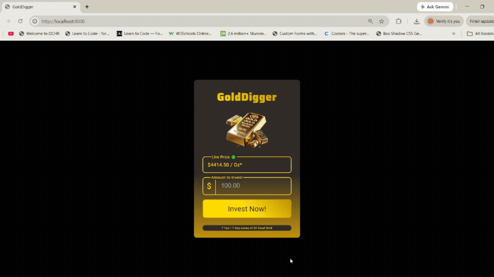
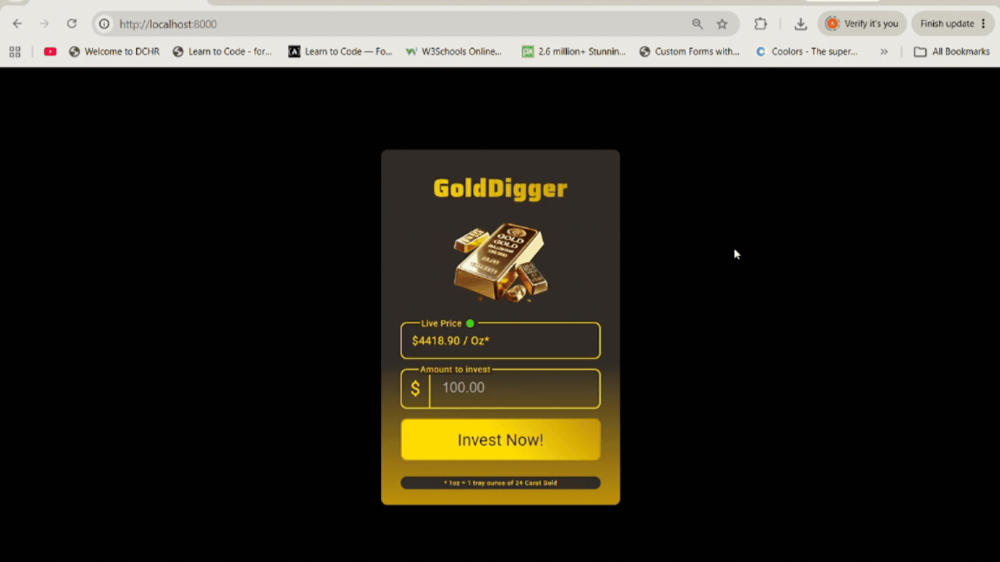
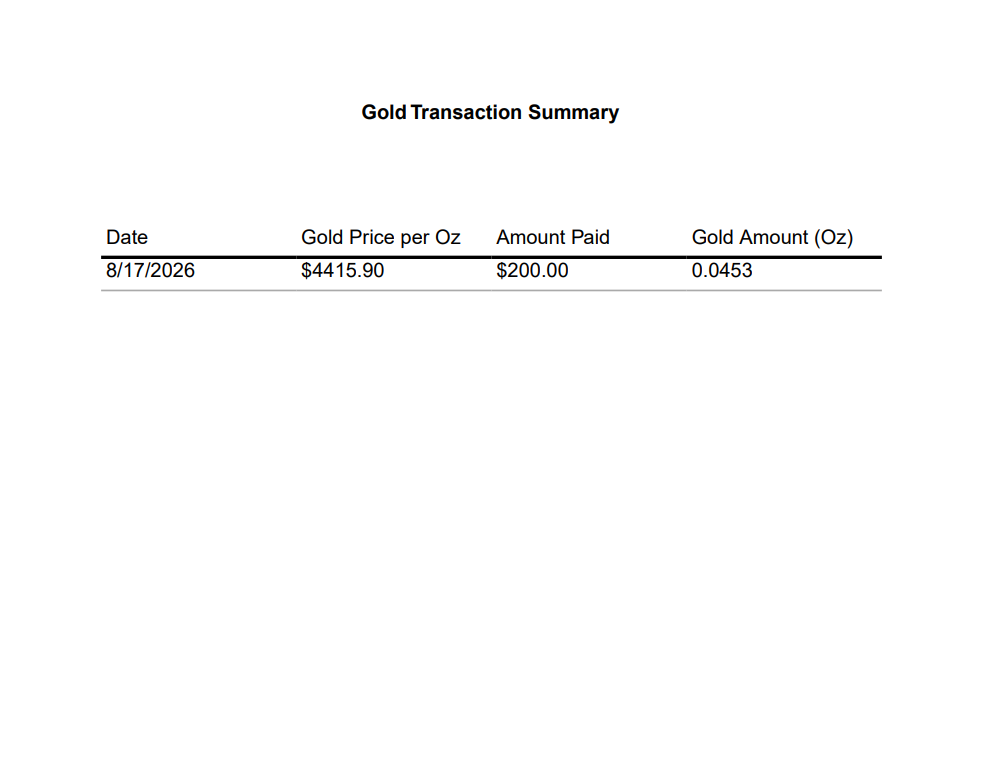
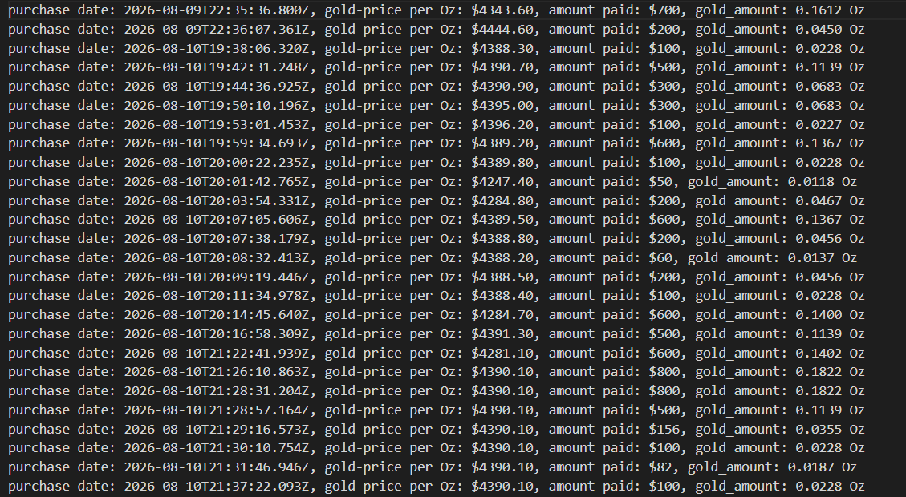

# Scrimba Solo Project - GoldDigger

This is a solo project from Scrimba's Node.js course that provides live gold price data in USD. The frontend code (HTML and CSS) was provided by Scrimba. The Node.js server implementation and backend development were built independently. The backend data was integrated with the frontend through DOM manipulation and API requests made to the Node.js server using the fetch api, Event Emitters, and Server Sent Events. 

The app is a widget that allows a user to track live gold prices and invest/purchase gold with a click of a button. The end goal is to log transactions to a text file. One of the stretch goals was to generate a pdf with the transaction details. When a user completes a gold purchase, the server generates a PDF using PDFKit and streams it directly in the HTTP response. The frontend receives this streamed PDF, converts it into a Blob, and automatically triggers a file download in the browser.The pdf generation was done using the PDFkit/PDFkit libraries. The provided Scrimba frontend originally showed gold prices in GBP. I customized the UI and data handling to switch the currency to USD. Live gold prices are retrieved from the Gold Price API with the currency set to USD. The Gold Price API updates slowly. It warns that data should only be fetched every 30 seconds. To handle this safely, I built a utility function that compares the newly fetched price to the previously cached value. If the API returns the same price after 30 seconds, the function generates a new value by adjusting the price randomly within a $50–$100 range so the frontend never displays stale data.

## Tech Stack

- Node.js — runtime environment powering the backend server

    - HTTP Module — used to build a lightweight custom server without Express

    - EventEmitter — handles internal server events and update triggers

    - EventSource (SSE) — streams live gold price updates to the frontend

    - FS Module — handles file operations used in the backend

    - Path Module — safely resolves file paths across different OS environments (OS agnostic)

- Fetch API — retrieves backend data from the frontend

- Gold Price API — external data provider for real‑time USD gold pricing. See acknowledgements/references for link to free API. 

- HTML & CSS — provided by Scrimba for the UI layout
## Dependencies

- "pdfkit": "^0.19.1",
- "pdfkit-table": "^0.2.11"
## Installation

Install with package manager of choice.

```bash
npm install Solo Project GoldDigger
# or
yarn add Solo Project GoldDigger
# or
pnpm add Solo Project GoldDigger
```

To run the project locally and see the live gold price demo, start the development server:
```bash
npm run dev
```
## Requirements 
- Serve all static files (HTML, CSS, JS)
- Update the frontend with live prices 
- Log user purchases to a text file 
- Utilize the following concepts:
    - HTTP, FS, Events, and Path Module
    - Routing
    - Serving static files and data
    - Event Emitters
    - Server Sent Events
- The app must show live gold prices and conditionally render a connection status indicator (green = connected, red = disconnected) in the frontend. 

## Usage/Examples
The live demo is powered by Nodemon, which automatically restarts the server whenever backend files change. This allows the gold‑price feed to update continuously during development. 


### App Demo 
Live gold prices are delivered to the frontend using Server‑Sent Events (SSE). The Node server continuously pushes updated gold price data every 30 seconds through a one‑way event stream.

The frontend listens to this stream using an EventSource connection. When the stream is active, the UI displays a green status indicator labeled Connected. If the SSE connection closes or the server becomes unreachable, the UI switches to a red indicator labeled Disconnected.
Successful responses trigger a green “Connected” indicator.

This ensures users always know whether the app is online and able to provide live pricing.

- App is online


- App is offline



### PDF file of Transaction



### Investment Log - Logged when EventEmitter function is triggered (When the user submits the form to make an investment)



## License

This project is licensed under the MIT License.  
See the [License](./License) file for details.


## Acknowledgements/References

 - [Gold Price API](https://gold-api.com/docs)
 - [PDFKit Package](https://www.npmjs.com/package/pdfkit?activeTab=readme)
 - [PDFKit-Table Package](https://www.npmjs.com/package/pdfkit-table)
 - [Nodemon Package](https://www.npmjs.com/package/nodemon)


